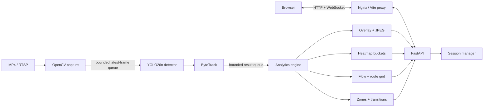
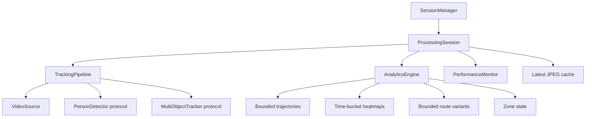

# Architecture

## Runtime topology

The capture and processing stages are separate workers. Live sources use `drop_oldest` so stale frames cannot grow latency or memory without bound. Offline files use backpressure and preserve every selected frame. Analytics/rendering runs on a second bounded queue so slow browser clients never block camera capture.

## Per-camera ownership

Tracker and analytics state belong to one camera session. The detector is exposed through a small protocol and may be shared later by a batched inference service. Calibration replaces the analytics engine atomically because historic pixel-space aggregates cannot be mixed with ground-plane coordinates.

## Data contracts

- Detector output: anonymous person boxes and confidence only.
- Tracker output: session-local track ID plus box/confidence.
- Trajectory point: frame ID, source timestamp, raw bottom-center and EMA-smoothed bottom-center.
- Spatial aggregates: fixed-size occupancy/movement/flow grids and fixed-duration buckets.
- Product aggregates: crowd timeline, compressed grid routes, zone occupancy, entries, exits, dwell and zone transitions.
- Delivery: latest JPEG cache, JSON REST snapshots and low-frequency WebSocket updates. Raw frames are not persisted by the server.

## Scale path

| Scale | Runtime shape | State and transport |
| --- | --- | --- |
| 1 camera | Current modular monolith | In-memory bounded state |
| 10 cameras | Independent ingest, shared/batched GPU inference, per-camera tracker workers | Internal RPC and central metrics |
| 100 cameras | Ingest fleet, partitioned GPU pool, scheduler/admission control, stateless analytics consumers | Durable anonymous-track event bus and time-series/columnar store |

Admission control must use end-to-end p95 measurements on the deployment codec/hardware with at least 30% headroom. Published model-only latency is not a camera-capacity measurement.
