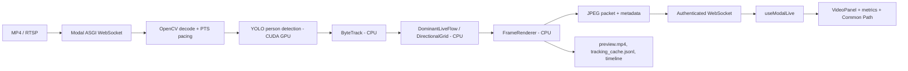

# Common Path trong hệ thống phân tích đám đông

Tài liệu này mô tả hành vi đang có trong source code và các file cấu hình hiện tại. Đây là Common Path của hệ thống, không phải một cam kết về độ chính xác nhận diện hay một thiết kế tương lai.

## 1. Bài toán và đầu ra

Hệ thống nhận video MP4 hoặc luồng RTSP. Mỗi frame đi qua detector người, ByteTrack, các bộ phân tích điểm/tracklet và renderer. Dashboard hiển thị video, điểm tracking ở chân người, metrics và Common Path nếu đã đủ bằng chứng. Với live Shibuya, Modal gửi JPEG frame nhị phân qua WebSocket; với backend thông thường, frontend nhận snapshot/MJPEG từ FastAPI.

Các thành phần chính:

- `backend/app/inference/ultralytics_detector.py::UltralyticsPersonDetector`: phát hiện class `person` bằng YOLO; tọa độ hộp chỉ là dữ liệu trung gian cho tracking.
- `backend/app/tracking/bytetrack_tracker.py::ByteTrackTracker`: ghép detection thành ID ổn định hơn và cung cấp bottom-center point. Chế độ hybrid kết hợp IoU với khoảng cách điểm.
- `backend/app/analytics/engine.py::AnalyticsEngine`: giữ state theo từng camera session và chọn engine Common Path.
- `backend/app/video/renderer.py::FrameRenderer`: mặc định chỉ vẽ tracking point, Common Path, mũi tên và metrics; bounding box, ID, ID trajectory cá nhân và grid debug đều tắt trong YAML.

### Common Path đang có nghĩa gì?

Có hai semantics, tùy entrypoint:

1. **Session/replay/batch thông thường:** `analytics.common_path.engine` trong `configs/default.yaml` và `configs/shibuya.yaml` là `directional_grid`. Engine có thể xác minh một route qua các cell từ endpoint vào đến endpoint ra. Với `configs/shibuya.yaml`, `directional_grid.display_policy: dominant_direction` làm output ưu tiên hướng có nhiều track nhất trong vùng liên thông; đây không phải tuyến OD hoàn chỉnh nếu chưa đủ complete tracks.
2. **Live Shibuya trên Modal:** `scripts/live_common_path.py` đọc `analytics.dominant_live_flow.mode`. Giá trị hiện tại là `dominant_live_flow`, vì vậy live dùng `backend/app/analytics/dominant_live_flow.py::DominantLiveFlowEngine`. Common Path ở đây là **cụm chuyển động cục bộ hiện thời có nhiều track nhất**, được gắn nhãn `east`, `west`, `northwest`... Nó không phải là tuyến vào-ra đã chứng minh bằng gate.

`backend/app/analytics/engine.py::common_path_snapshot()` chọn output giữa legacy và `DirectionalGridEngine`. Giá trị `shadow` chạy cả legacy và directional engine nhưng chỉ hiển thị engine được chọn bởi `shadow_display`. Legacy vẫn là rollback option; không phải engine live Modal hiện tại.

## 2. Cách thuật toán hoạt động

### Detection, tracking và point/tracklet

`TrackingPipeline` trong `backend/app/video/pipeline.py` có worker đọc frame và worker xử lý. Worker gọi detector rồi `ByteTrackTracker.update()`. Detector dùng `class_id=0`; các tham số chính của default là `imgsz=1280`, confidence `0.05`, IoU `0.60`, `max_det=1000`. Shibuya dùng tiled inference (`2 x 2`, overlap `0.20`) và confidence `0.04` trong `configs/shibuya.yaml`.

ByteTrack dùng các ngưỡng trong YAML. Khi `association_mode: hybrid`, `_association_cost()` trong `bytetrack_tracker.py` lấy IoU cost và bottom-center distance; `max_center_distance_ratio` giới hạn khoảng cách theo đường chéo frame. Vận tốc Kalman rất nhỏ được giảm (`stationary_boost`) để người đứng yên không bị trôi. Track mất tạm thời được trả ra với `observed=False` trong grace frames; Common Path chỉ nhận điểm `confirmed` và `observed`, nên prediction-only frame không tạo vote mới.

Trong live, `GridTrackPoint` chứa `camera_id`, `stream_epoch`, `track_id`, `frame_id`, `event_time_s`, `(x, y)`, `confirmed`, `observed` (`backend/app/analytics/directional_grid.py`). Khóa track bao gồm camera/epoch/ID; epoch mới không trộn dữ liệu của stream cũ.

### Grid, hướng và directional histogram

#### DirectionalGridEngine (batch/replay/session)

`DirectionalGridEngine` dùng grid mặc định **32 cột x 18 hàng**, 8 direction bins. Cell được tính từ tọa độ đã qua `SpatialTransformer`; nếu chưa calibrate thì `coordinate_space` là `image_pixels`.

Với mỗi track:

1. Lấy displacement trong cửa sổ `direction_sample_seconds=0.3` giây.
2. Track phải có tuổi tối thiểu `0.5` giây và displacement chuẩn hóa theo kích thước cell ít nhất `0.15` cell.
3. Góc được tính bằng `atan2(dy, dx)`, chia đều thành 8 bin (east, southeast, south, southwest, west, northwest, north, northeast).
4. Vote được lưu ở `_bins[(cell, direction)]` với một timestamp cho mỗi `TrackKey`. Hàm `histogram()` trả về cho từng cell/bin hai số: số track còn trong short window 30 giây và tổng số track trong evidence hiện có. Đây là directional histogram theo cell, không phải histogram toàn frame đếm detection thô.

Khi người đi từ cell này sang cell khác, cell mới phải ổn định ở hai quan sát và nằm sâu trong 0.43 cell; bước tối đa là `max_step_cells=2.5`. Nhảy quá lớn hoặc gap quá `0.5` giây tạo segment mới, không nối bắc cầu qua đoạn mất dữ liệu. Mỗi track chỉ đóng góp một khóa vào edge `(source_cell, target_cell)`; do đó nhiều frame của cùng một ID không làm tăng unique support. Evidence cũ hơn long window 180 giây bị prune.

Edge score dùng flow snapshot:

```text
score = 0.65 * short_count / short_age
      + 0.35 * long_count / long_age
```

Trong `CommonPathConfig` của engine legacy, cơ chế tương tự dùng short/long weight `0.40/0.60` và exponential decay; đó là engine khác và không phải công thức flow snapshot của `DirectionalGridEngine` hiện tại.

#### DominantLiveFlowEngine (live Shibuya)

Live không tích lũy route OD dài hạn. `DominantLiveFlowEngine.update()` giữ tối đa `max_tracks=4096`, tối đa `64` point/track và chỉ giữ `history_seconds=3.0`. Một track được vote khi quan sát cuối không cũ quá `0.6` giây, có mẫu trước đó cách hiện tại từ `0.3` đến `0.8` giây, và displacement chuẩn hóa đạt `0.15` cell.

Vector displacement được làm mượt theo:

```text
smoothed = 0.4 * current_displacement + 0.6 * previous_smoothed
```

Sau đó `atan2` được lượng tử hóa thành 8 bin. Các vote cùng hướng trong các cell kề nhau 8-neighbor được gom thành connected component (`_clusters()`). Một component có một vote cho mỗi track đang quan sát, nên `cluster.count` là số track support hiện thời, không phải số detection/frame.

Người đứng yên bị loại khi displacement dưới `0.15` cell; người bị mất observation quá timeout không còn vote, nhưng track history vẫn chỉ tồn tại trong 3 giây. Polyline live là đoạn thẳng theo hướng của component, kéo dài tối thiểu `1.5` cell (`min_geometry_cells`). Label được tạo từ `direction_bin`, với tên hướng theo thứ tự east, southeast, south, southwest, west, northwest, north, northeast.

### Tạo, kiểm chứng và chọn Common Path

#### Route validation của DirectionalGridEngine

Nếu `display_policy` là `validated_route`, engine dựng adjacency từ edge có ít nhất `min_edge_unique_tracks=3`, tìm route bằng beam search (`beam_width=20`, tối đa `max_path_cells=128`, tối thiểu `min_path_cells=4`). Endpoint là entry/exit zones nếu có; nếu không có zone, engine dùng cell biên của track bắt đầu/kết thúc. `configs/shibuya-zones.json` hiện không cung cấp polygon nên fallback biên này được dùng cho route global.

Một track support route khi thứ tự cell của nó phủ ít nhất `min_ordered_coverage=0.70`, với sai số cell `cell_tolerance=1`. Track complete phải đi đúng start/end route; cần ít nhất `min_support_tracks=5` support và `min_complete_tracks=3` complete. Candidate được xếp hạng theo complete/support/score; tối đa 5 candidate được giữ để diagnostics.

Khi `display_policy: dominant_direction`, `_select_dominant_direction()` gom các cell cùng hướng thành component và xếp hạng trước hết theo short support, sau đó support và score. Cấu hình Shibuya đặt ngưỡng hiển thị tối thiểu `dominant_min_support_tracks=1`, nên đây là chế độ quan sát dominant-direction nới lỏng hơn route validation.

#### Confirmation, switch và cooling

Với route directional, candidate mới phải giữ ổn định `confirmation_seconds=8` giây. Route khác chỉ được thay active khi score vượt:

```text
active_score * (1 + switch_relative_margin) + switch_absolute_margin
```

Mặc định là `1.20 * active_score + 0.01`. Route tương tự được giữ lại nếu directed-edge similarity đạt `0.65` trong `_same_route()`; centerline được blend với EMA alpha `0.20`. Evidence không còn đủ sẽ chuyển sang `cooling` và retired sau `20` giây.

Với live dominant flow, không có ưu tiên đặc biệt cho hướng “đông hơn” theo nghĩa địa lý. Engine chọn component lớn nhất theo `cluster.count`. Challenger phải có ít nhất `active_count + challenger_margin_tracks` track, với `challenger_margin_tracks=1`, và giữ được `confirmation_seconds=2.0` giây. Nếu active không còn match thì nó chuyển `cooling`; sau `stale_seconds=1.5` giây không có match, active bị retire. Vì vậy trạng thái UI có thể là `learning`, `confirming`, `active` hoặc `cooling`; trước khi đủ evidence renderer hiển thị “Collecting movement flow...”/“Đang tích lũy, chưa đủ dữ liệu”, không vẽ đường giả.

## 3. Luồng realtime



Trong `modal_shibuya_live.py::live_api()`:

- Modal mount `/root/data` vào Volume `crowd-analysis-data`, kiểm tra hash input/model rồi bắt buộc `torch.cuda.is_available()`. Nếu không có CUDA, endpoint báo lỗi và không fallback CPU.
- Auth nhận token ở message `{"action":"authenticate",...}` trước `start`; token không nằm trong WebSocket URL. Lệnh start chỉ cho `duration_seconds` từ 1 đến 65.1, preview FPS 1 đến 15 và `processing_mode="realtime_pts"`.
- `scripts/live_common_path.py::LiveCommonPathProcessor.frames()` dùng YOLO với `device="cuda:0"`. Tracking, analytics, OpenCV render/encode và ghi file chạy trong container Modal nhưng không phải CUDA kernel riêng.
- State ngắn hạn (track, histogram/component, path state) nằm trong process của một live session. Output bền vững được ghi vào `/root/data/common_path/runs/<run_id>` rồi `volume.commit()`.

`realtime_pts` giữ playback gần timestamp nguồn. Nếu inference chậm hơn video, processor dùng `cap.grab()` để bỏ frame nguồn cũ (`dropped_input_frames`) thay vì xử lý backlog. Preview chỉ lấy frame theo `preview_fps`; giữa hai preview, `preview.mp4` lặp frame render gần nhất để giữ đúng độ dài video. Phía WebSocket có `queue.Queue(maxsize=1)`, khi đầy sẽ bỏ item cũ và tăng `transport_dropped_frames`. Frontend bỏ packet có `frame_id` không tăng, giải mã JPEG thành `Blob URL`, cập nhật metadata cùng frame và gửi `frame_ack` (`frontend/src/hooks/useModalLive.ts`).

Mỗi frame analytics dùng cùng `source_frame_id` và `media_time_s = frame_id / source_fps`. Code kiểm tra `event_time_s` monotonic và không cho `evidence_until_s` mới hơn frame đang render; điều này tránh vẽ path tương lai lên ảnh hiện tại.

### Phân biệt ba loại chạy

- **Inference thật:** `modal_shibuya_live.py` hoặc `modal_app.py` khởi tạo YOLO và gọi detector. Live Shibuya bắt buộc GPU Modal.
- **Replay cache:** `tracking_cache.jsonl` chứa detections/tracks đã lưu; replay dùng detector cache (`detect_packet`) và không gọi YOLO. Có thể chạy CPU local để đổi analytics/render.
- **Video output:** `preview.mp4` hoặc `realtime_point_common_path.mp4` là artifact đã render, không phải bằng chứng rằng một lượt inference mới đang chạy.

## 4. Triển khai và chạy

### Dependency và cấu hình

Backend cần Python 3.11–3.14, package trong `pyproject.toml`/`requirements.txt`, Ultralytics và model `yolo26n.pt`. Frontend cần Node.js 24+ và các package trong `frontend/package.json`.

Cấu hình chính:

- `configs/default.yaml`: server, detector, ByteTrack, queue, legacy/directional settings.
- `configs/shibuya.yaml`: tiled detector, ngưỡng tracker Shibuya và `dominant_live_flow.mode: dominant_live_flow` cho live.
- `frontend/.env`: `VITE_BACKEND_URL` cho FastAPI.
- Live frontend cần `VITE_MODAL_LIVE_WS_URL`, `VITE_MODAL_LIVE_TOKEN`, tùy chọn `VITE_MODAL_LIVE_DURATION_SECONDS`, `VITE_MODAL_LIVE_PREVIEW_FPS`, `VITE_MODAL_LIVE_RUN_ID`. Không ghi giá trị token vào tài liệu, git hoặc output.
- Modal cần `LIVE_SESSION_TOKEN` trong process deploy. Source/video và model được lấy từ Modal Volume theo hash trong `modal_shibuya_live.py`; file local thiếu hoặc hash khác sẽ bị từ chối.

### Backend/frontend local

```powershell
python -m venv .venv
.\.venv\Scripts\Activate.ps1
python -m pip install -e ".[dev]"
python -m uvicorn backend.main:app --reload --port 8000
```

Terminal frontend:

```powershell
Set-Location frontend
npm ci
npm run dev -- --port 5173
```

Mở `http://localhost:5173`. Đây là entrypoint development trong README; nó chạy backend theo `device: auto`, nên không được dùng để khẳng định inference GPU Modal.

### Live Shibuya trên Modal

Terminal Modal:

```powershell
$env:LIVE_SESSION_TOKEN = [Convert]::ToHexString(
  [Security.Cryptography.RandomNumberGenerator]::GetBytes(24)
).ToLower()
modal serve modal_shibuya_live.py
```

Lấy URL `https://...modal.run` mà Modal in ra, đổi thành `wss://...modal.run/ws/live`, rồi ở terminal frontend:

```powershell
Set-Location frontend
$env:VITE_MODAL_LIVE_WS_URL = "wss://<modal-host>/ws/live"
$env:VITE_MODAL_LIVE_TOKEN = "<session-token>"
$env:VITE_MODAL_LIVE_DURATION_SECONDS = "25"
$env:VITE_MODAL_LIVE_PREVIEW_FPS = "10"
$env:VITE_MODAL_LIVE_RUN_ID = "live-shibuya-YYYYMMDD"
npm run dev -- --port 5176
```

Mở `http://localhost:5176`, nhấn **Start GPU inference**, và nhấn **Stop** để kết thúc sớm. Đây là lệnh entrypoint đã có trong README/source. Tài liệu này không khởi chạy lại lệnh nào; việc kiểm chứng cụ thể phải xem `manifest.json`, `metrics.json`, `live_verification.json`, `preview.mp4` và screenshot trong `outputs/<run-id>/`.

### Batch Modal và replay

Inference batch Common Path:

```powershell
$env:PYTHONUTF8="1"
modal run --quiet modal_common_path.py `
  --input data/videos/data-test.mp4 `
  --start-seconds 0 --duration-seconds 25 `
  --engine shadow --mode offline_fast `
  --config configs/default.yaml `
  --run-id dg-smoke-YYYYMMDD-a --cache-policy reuse
```

Bỏ `--duration-seconds 25` để xử lý từ `--start-seconds` đến hết video. Chỉ thêm tham số này
khi cần giới hạn một đoạn ngắn để smoke test hoặc replay.

Replay analytics từ cache, không gọi detector:

```powershell
python -m scripts.common_path_clip `
  --input <source-video.mp4> `
  --config configs/default.yaml `
  --output-dir outputs/common_path/replay-YYYYMMDD `
  --run-id replay-YYYYMMDD `
  --engine directional_grid `
  --replay-cache <tracking_cache.jsonl>
python -m scripts.replay_ui --cache <tracking_cache.jsonl>
```

`data/videos/data-test.mp4` và `<tracking_cache.jsonl>` phải tồn tại; tài liệu này không giả định chúng có sẵn trong checkout. Các lệnh trên là entrypoint source hiện có, nhưng chưa được chạy trong lượt tạo tài liệu này.

## 5. Giới hạn và kiểm chứng

- Không có ground-plane calibration mặc định; kết quả thường ở pixel space và đường Common Path không phải khoảng cách thực tế.
- Shibuya không có zone polygon trong `configs/shibuya-zones.json`; DirectionalGrid fallback dùng boundary cell, còn live dominant flow không dùng endpoint gate.
- `dominant_live_flow` là heuristic current-flow: track ID switch, occlusion, cảnh đông và camera time-lapse có thể làm thay đổi support hoặc hướng. `cluster.count` không phải số người duy nhất trong toàn video.
- `realtime_pts` chủ động bỏ frame khi GPU không theo kịp; output và UI có thể không hiển thị mọi source frame. `queue_size` backend mặc định là 4, live transport queue là 1.
- Common Path không xuất hiện ngay: live cần tối thiểu 3 track đang chuyển động, displacement hợp lệ và 2 giây confirmation; route directional cần các ngưỡng support/complete và 8 giây.
- Build pass hoặc HTTP 200 chỉ chứng minh build/health endpoint. Chúng không chứng minh frame đã tới browser hay path được vẽ. Cần mở screenshot/video và kiểm tra `frame_id`, timestamp, `path_state`, `direction`, `ui_received_before_completion`.
- Lượt smoke 20–30 giây chỉ phù hợp kiểm tra wiring và trạng thái; không đủ để kết luận ổn định dài hạn hay độ chính xác. Không có con số FPS/precision nào được suy ra nếu chưa có artifact tương ứng.

Các test unit của engine nằm ở `tests/test_common_path.py`, `tests/test_directional_grid.py`, `tests/test_dominant_live_flow.py` và `tests/test_live_common_path_processor.py`. Chúng kiểm tra logic/state bằng dữ liệu tổng hợp; chúng không thay thế kiểm chứng YOLO CUDA và browser stream.
