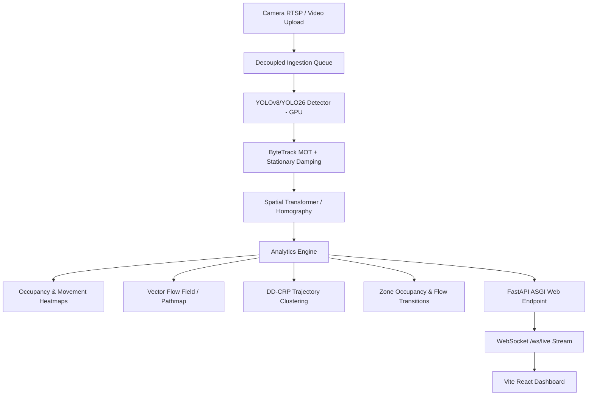

# BÁO CÁO NGHIÊN CỨU & ỨNG DỤNG HỆ THỐNG PHÂN TÍCH ĐÁM ĐÔNG (CROWD ANALYSIS)

**Dự án:** Realtime Crowd Intelligence & Flow Analysis  
**Bộ công cụ & Nền tảng:** YOLOv8/YOLO26, ByteTrack, DD-CRP, OpenCV, FastAPI, Modal Serverless GPU, React  
**Tác giả:** Hà Hoàng Tuấn Hùng  
**Ngày cập nhật:** 16/09/2026  

---

## MỤC LỤC
1. [Phần 1: Mở Đầu & Đặt Vấn Đề (Introduction & Problem Statement)](#phần-1-mở-đầu--đặt-vấn-đề)
2. [Phần 2: Tổng Quan & So Sánh Phương Pháp (Literature Review & Comparison)](#phần-2-tổng-quan--so-sánh-phương-pháp)
3. [Phần 3: Kiến Trúc Hệ Thống & Thuật Toán Áp Dụng (System Architecture & Pipeline)](#phần-3-kiến-trúc-hệ-thống--thuật-toán-áp-dụng)
4. [Phần 4: Giải Quyết Các Bài Toán Hóc Búa Thực Tế (Corner Cases)](#phần-4-giải-quyết-các-bài-toán-hóc-búa-thực-tế)
5. [Phần 5: Các Hướng Tối Ưu Hệ Thống Cho Môi Trường Production (Production Optimization)](#phần-5-các-hướng-tối-ưu-hệ-thống-cho-môi-trường-production)
6. [Phần 6: Kết Luận & Hướng Phát Triển Tiếp Theo (Conclusion & Future Work)](#phần-6-kết-luận--hướng-phát-triển-tiếp-theo)

---

## PHẦN 1: MỞ ĐẦU & ĐẶT VẤN ĐỀ

### 1.1. Bối cảnh và Tính cấp thiết
- Sự gia tăng mật độ người tại các đầu mối giao thông công cộng (nhà ga tàu điện Grand Central, Metro, sân bay), các trung tâm thương mại lớn, sự kiện văn hóa thể thao, khu đô thị thông minh.
- Thách thức: Quản lý lưu lượng người, giảm thiểu ùn tắc tại các điểm nghẽn (cửa kiểm soát vé, cầu thang, hành lang hẹp), phát hiện sớm nguy cơ chen lấn/giẫm đạp, tối ưu bố trí quầy dịch vụ và an ninh.

### 1.2. Mục tiêu nghiên cứu & sản phẩm của đề tài
- Xây dựng hệ thống thị giác máy tính toàn diện có khả năng:
  1. **Crowd Counting:** Đếm số người hiện tại, trung bình và đỉnh lưu lượng theo thời gian.
  2. **Density & Spatial Heatmaps:** Bản đồ nhiệt mật độ đám đông đứng yên (*Occupancy*) và mật độ chuyển động (*Movement*).
  3. **Multi-Object Tracking (MOT):** Theo dõi liên tục hành trình của từng cá nhân qua camera cố định.
  4. **Pathmap & Vector Flow Field:** Phân tích trường vector hướng di chuyển chủ đạo.
  5. **Popular Pathways & Stationary Clustering (DD-CRP):** Nhận diện các tuyến đường chính và cụm người đứng yên mua vé.
  6. **Interactive Dashboard:** Giao diện trực quan thời gian thực, có khả năng vận hành serverless trên nền tảng đám mây GPU.

---

## PHẦN 2: TỔNG QUAN & SO SÁNH PHƯƠNG PHÁP

### 2.1. Các phương pháp truyền thống
1. **Background Subtraction & Gaussian Mixture Models (GMM):**
   - *Cơ chế:* So sánh pixel của frame hiện tại với mô hình nền để tách blob chuyển động.
   - *Hạn chế:* Không phân biệt được cá thể người khi đi sát nhau; ánh sáng đổi hay bóng đổ gây nhiễu nghiêm trọng; người đứng yên sẽ bị hòa vào ảnh nền sau một vài giây.
2. **Optical Flow cổ điển (Lucas-Kanade, Farneback):**
   - *Cơ chế:* Tính toán vector chuyển động của các điểm đặc trưng giữa hai frame liên tiếp.
   - *Hạn chế:* Chi phí tính toán cao; không lưu giữ được ID dài hạn; người đứng yên mua vé có vận tốc bằng 0 nên hoàn toàn bị bỏ sót.
3. **Density Map Regression (HOG + SVM, Haar Cascades, Ridge Regression):**
   - *Cơ chế:* Ước lượng mật độ người dựa trên đặc trưng hình dáng tĩnh.
   - *Hạn chế:* Khi che khuất (*occlusion*) nặng, tỉ lệ nhận diện sai rất cao; không trích xuất được quỹ đạo di chuyển (*trajectories*).

### 2.2. Phương pháp hiện đại (Deep Learning + Tracking 2 tầng + Bayesian Non-Parametric)
- **Object Detection (YOLO Architecture):** Tận dụng mạng tích chập/attention để trích xuất bounding box người với độ chính xác cao ở độ phân giải cao (1080p, 1280px).
- **ByteTrack Multi-Object Tracking:** Tận dụng cả detection có confidence cao lẫn confidence thấp (low-score boxes) để duy trì track ID khi người bị che khuất một phần.
- **Perspective Homography Transform:** Chuyển đổi tọa độ phối cảnh camera bị biến dạng góc chéo về mặt sàn phẳng thực địa (*ground-plane*).
- **Thuật toán DD-CRP (Distance-Dependent Chinese Restaurant Process):** Mô hình Bayesian phi tham số gom cụm quỹ đạo theo không gian và hướng, tự động phân nhóm các luồng di chuyển và vị trí xếp hàng mua vé.

### 2.3. Bảng so sánh chi tiết giữa các phương pháp

| Tiêu chí | Phương pháp truyền thống (GMM, Optical Flow) | Phương pháp Deep Learning (YOLO + ByteTrack + DD-CRP) |
| :--- | :--- | :--- |
| **Khả năng đếm số lượng** | Kém khi mật độ đông, dễ đếm gộp cụm | Rất tốt, phân tách từng cá nhân rõ ràng |
| **Khả năng duy trì ID** | Rất yếu, thường xuyên mất dấu sau vài frame | Ổn định nhờ bộ lọc Kalman kết hợp ma trận chi phí Hybrid IoU/Center distance |
| **Nhận diện người đứng yên (Quầy vé)** | Thất bại (bị xem là nền tĩnh) | Tốt (nhận diện qua bounding box tĩnh và cơ chế hãm trôi Kalman) |
| **Khám phá lộ trình (Pathways)** | Răng cưa, phụ thuộc vào việc chia lưới tĩnh cứng nhắc | Mượt mà, tự động tìm ra các tuyến đường tự nhiên theo xác suất |
| **Khả năng chống chịu che khuất** | Kém | Cao (nhờ giai đoạn liên kết thứ 2 của ByteTrack) |
| **Chi phí phần cứng** | Thấp (chạy được trên CPU cơ bản) | Cần GPU (NVIDIA T4/A10/RTX) để đảm bảo thời gian thực |

---

## PHẦN 3: KIẾN TRÚC HỆ THỐNG & THUẬT TOÁN ÁP DỤNG

### 3.1. Pipeline xử lý hình ảnh & Tracking
- **Detection:** Ultralytics YOLO inference với `imgsz=1280`, phát hiện class `person` (class 0).
- **Association (ByteTrack Hybrid Mode):**
  $$Cost(T_i, D_j) = \min \left( 1 - \text{IoU}(T_i, D_j), \frac{\|\mathbf{p}_{T_i} - \mathbf{p}_{D_j}\|_2}{\text{Diagonal} \times \text{threshold}} \right)$$
  Cho phép theo dõi ngay cả khi người đi bộ ở cự ly xa có bounding box rất nhỏ không có diện tích đè lên nhau giữa hai frame liên tiếp.

### 3.2. Thuật toán DD-CRP (Distance-Dependent Chinese Restaurant Process)
- **Hàm khoảng cách kết hợp giữa hai tracklet $T_i$ và $T_j$:**
  $$D(T_i, T_j) = d_{\text{spatial}} + w_{\text{dir}} \cdot \sigma \cdot d_{\text{angular}}$$
  Trong đó:
  - $d_{\text{spatial}} = 0.5 \cdot d_{\text{center}} + 0.25 \cdot (d_{\text{start}} + d_{\text{end}})$
  - Với người chuyển động: $d_{\text{angular}} = 1 - \cos(\theta_{ij})$
  - Với người đứng yên mua vé ($disp < \tau$): $d_{\text{angular}} = 0$, ưu tiên gom cụm theo vị trí địa lý của quầy vé.
- **Xác suất liên kết Bayesian:**
  $$P(c_i = j) \propto \exp\left(-\frac{D(T_i, T_j)}{\sigma}\right) \quad (j \neq i), \qquad P(c_i = i) \propto \alpha \quad (\text{Mở cụm mới})$$

---

## PHẦN 4: GIẢI QUYẾT CÁC BÀI TOÁN HÓC BÚA THỰC TẾ

### 4.1. Bài toán người đứng yên mua vé (Stationary Pedestrians at Ticket Booths)
- **Vấn đề:** 
  - Mô hình Kalman Filter truyền thống của ByteTrack giả định vật thể chuyển động với vận tốc đều (*Constant Velocity Model*). Khi người đứng yên mua vé lâu, vận tốc Kalman bị trôi (*drift*).
  - Khi có người đi lướt qua che khuất 1-2 giây, track buffer ngắn ($60$ frames $\approx 2.4$ giây) sẽ xóa track và tạo ID mới khi người xuất hiện trở lại.
- **Giải pháp triển khai trong dự án:**
  1. Thêm cơ chế **Stationary Velocity Damping**: Khi vận tốc khung hình $\|(v_x, v_y)\| < 3.0$ px/frame, hệ số vận tốc trong ma trận trạng thái Kalman được hãm triệt để (`mean[4:6] *= 0.1`), khóa chặt bounding box tại vị trí quầy vé.
  2. Nâng `track_buffer` lên **120 - 150 frames** (giữ track 5–6 giây khi bị che khuất).
  3. Tăng `lost_track_grace_frames` lên **8 frames** để duy trì hiển thị liên tục, tránh hiện tượng nhấp nháy ID.
  4. Thuật toán DD-CRP tự động gán nhãn `ddcrp_stationary`: gom nhóm các track đứng yên thành cụm `"Quầy vé / Xếp hàng: (X, Y) - N người"`.

### 4.2. Bài toán camera góc chéo và biến dạng phối cảnh (Perspective Distortion)
- Người ở gần camera trông rất to, người ở xa quầy vé rất nhỏ (chỉ 15-25 pixel).
- Áp dụng ma trận biến đổi Homography $3 \times 3$ để ánh xạ tọa độ pixel nghiêng về mặt sàn chuẩn tỷ lệ mét thực tế, đảm bảo mật độ người/m² được tính toán công bằng trên toàn bộ diện tích nhà ga.

---

## PHẦN 5: CÁC HƯỚNG TỐI ƯU HỆ THỐNG CHO MÔI TRƯỜNG PRODUCTION

### 5.1. Tối ưu hóa Mô hình & Inference
1. **Chuyển đổi TensorRT & Lượng tử hóa FP16 / INT8:**
   - Biên dịch model YOLO `.pt` sang TensorRT `.engine` tối ưu riêng cho phần cứng GPU mục tiêu (NVIDIA T4/A10/L4).
   - Sử dụng lượng tử hóa FP16 giúp tăng tốc độ xử lý lên gấp $2 - 3.5$ lần, giảm 50% mức tiêu thụ VRAM.
2. **Adaptive Inference Interval & Optical Flow Tracking:**
   - Không cần chạy YOLO trên toàn bộ 100% frame. Có thể chạy detector ở chu kỳ $1/2$ hoặc $1/3$ frame (ví dụ: Frame 1, Frame 3, Frame 5...).
   - Các frame ở giữa sử dụng tracker để nội suy vị trí, giúp tiết kiệm $50\%$ tài nguyên GPU mà vẫn đảm bảo 25-30 FPS mượt mà.
3. **SAHI (Slicing Aided Hyper Inference):**
   - Áp dụng kỹ thuật chia lát ảnh động nếu cần phát hiện người cực nhỏ ở cự ly siêu xa (> 50 mét) trong các sảnh hội nghị rộng lớn.

### 5.2. Tối ưu hóa Kiến trúc luồng & Đảm bảo thời gian thực (Concurrency & Latency)
1. **Chính sách hàng đợi Bounded Frame Queue:**
   - Trong camera giám sát thời gian thực, độ trễ (*Realtime Latency*) quan trọng hơn việc xử lý mọi frame trễ nải.
   - Duy trì hàng đợi có giới hạn (`maxsize=4`) kết hợp chính sách `drop_oldest`. Khi GPU quá tải hoặc mạng chập chờn, tự động hủy các frame cũ nhất để luôn xử lý frame mới nhất của camera.
2. **Đa luồng tách rời (Decoupled Multiprocessing):**
   - *Process A:* Thu nhận luồng RTSP và giải mã phần cứng (Hardware NVDEC).
   - *Process B:* Batch inference trên GPU TensorRT.
   - *Process C:* Cập nhật Tracker, Analytics, DD-CRP.
   - *Process D:* WebSocket server truyền dữ liệu nén về giao diện Web.

### 5.3. Triển khai Đám mây Serverless MLOps
1. **Tối ưu hóa Docker Image:**
   - Đóng gói sẵn toàn bộ các dependency hệ thống (`lap>=0.5.12`, `ffmpeg`, `libgl1`, `torch`) vào image cache của container để triệt tiêu thời gian chờ build khi container khởi động (*Cold start*).
2. **Auto-scaling & Scale-to-Zero:**
   - Triển khai dạng Serverless ASGI endpoint (như Modal). Khi không có luồng camera hay người dùng truy cập, hạ container về 0 để không phát sinh chi phí GPU. Khi có request hoặc stream tới, tự động bật container trong vòng vài giây.
3. **Streaming chuẩn WebRTC:**
   - Nâng cấp từ truyền tải Frame JPEG sang giao thức **WebRTC (H.264/AV1)** để giảm băng thông truyền tải mạng tới 80% và giữ độ trễ dưới $150\text{ms}$.

### 5.4. Giám sát hệ thống (Observability) & Bảo vệ quyền riêng tư (Privacy)
1. **Privacy-by-Design:**
   - Toàn bộ dữ liệu xử lý là ẩn danh (Anonymous). Không lưu trữ khuôn mặt hay đặc điểm nhận dạng cá nhân (PII). Chỉ lưu trữ bounding box toạ độ số học và vector di chuyển, tuân thủ chặt chẽ tiêu chuẩn an toàn dữ liệu và quyền riêng tư (GDPR).
2. **Hệ thống giám sát chỉ số (Metrics & Alerts):**
   - Tích hợp Prometheus/OpenTelemetry thu thập: FPS thực tế, Dropped frames, Inference latency (p95, p99), VRAM/GPU Utilization, Network throughput.
   - Cảnh báo tức thì (Telegram / Webhook) khi số lượng người trong một zone vượt ngưỡng an toàn (*Crowd surge alert*).

---

## PHẦN 6: KẾT LUẬN & HƯỚNG PHÁT TRIỂN TIẾP THEO

### 6.1. Tóm tắt kết quả
- Hoàn thiện pipeline Crowd Analysis từ khâu nhận diện, theo dõi liên tục, gom cụm lộ trình bằng DD-CRP đến hiển thị giao diện Live Source hiện đại.
- Giải quyết dứt điểm hiện tượng bỏ sót người đứng yên mua vé và tối ưu hóa hệ thống để sẵn sàng vận hành trên nền tảng Cloud GPU Serverless.

### 6.2. Hướng nghiên cứu tiếp theo
- **Cross-Camera Multi-Target Multi-Camera (MTMC) Tracking:** Theo dõi hành trình của một người qua nhiều camera không đồng nhất trong tòa nhà lớn bằng Re-Identification (ReID).
- **Phát hiện hành vi bất thường (Anomaly Detection):** Tự động phát hiện các sự cố bất thường như người ngã, đánh nhau, dòng người chạy tán loạn hoặc đi ngược chiều dòng chảy quy định.
- **Auto-calibration:** Sử dụng mạng nơ-ron tự động tính toán ma trận Homography từ các đường nét kiến trúc tòa nhà mà không cần con người chọn 4 điểm hiệu chuẩn thủ công.

---
*Tài liệu này được lưu trữ tại `docs/crowd-analysis-report-outline.md` trong mã nguồn dự án để bạn có thể chỉnh sửa, bổ sung nội dung chi tiết và xuất sang Word/PDF.*
