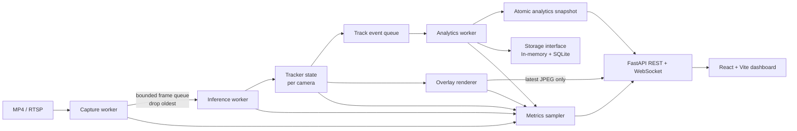

# Phase 1 - Research & Architecture

Ngày nghiên cứu: 2026-09-13

Trạng thái: **Đã hoàn tất research gate, chưa có kết luận benchmark trên video đích.**

## 1. Problem understanding

Sản phẩm cần trả lời bài toán **crowd flow analysis**, không chỉ crowd counting:

- Có bao nhiêu người tại thời điểm hiện tại và theo thời gian?
- Người thường xuất hiện hoặc đứng ở đâu (occupancy)?
- Người thực sự di chuyển qua đâu (movement density)?
- Hướng và tuyến đường nào được sử dụng nhiều nhất?
- Các zone có occupancy, entry, exit, dwell time và flow như thế nào?
- Pipeline có đáp ứng realtime và bounded-memory không?

Đầu vào là MP4 hoặc RTSP từ camera cố định. Track ID chỉ có ý nghĩa trong một phiên xử lý và không đại diện cho danh tính. Hệ thống không dùng face recognition hoặc cross-camera person re-identification.

Đơn vị vị trí mặc định là bottom-center của bounding box. Analytics chạy ở một trong hai hệ tọa độ:

1. `pixel`: kết quả tương đối theo ảnh camera;
2. `ground`: điểm được chiếu qua homography sau khi người dùng chọn bốn điểm calibration.

Nếu chưa calibration, API và UI phải gắn `spatial_mode=pixel` và cảnh báo rõ rằng density/distance chỉ mang tính tương đối.

## 2. Research findings

### 2.1 Detector

Số liệu dưới đây là số công bố trên COCO và hardware của tác giả, chỉ dùng để chọn ứng viên. Chúng **không phải benchmark của project** và không được so sánh như end-to-end FPS camera.

| Detector | COCO mAP50-95 | Latency công bố | Quy mô | CPU/GPU | Export | License | Nhận định |
| --- | ---: | --- | --- | --- | --- | --- | --- |
| YOLO26n, 640 | 40.9; e2e 40.1 | CPU ONNX 38.9 ms; T4 TensorRT10 1.7 ms | 2.4M params; 5.5B FLOPs | Nhẹ nhất trong shortlist | ONNX, TensorRT và nhiều target khác | AGPL-3.0 hoặc Enterprise | Baseline hợp lý cho realtime/edge; NMS-free là tùy chọn, có giảm AP |
| YOLO26s, 640 | 48.6; e2e 47.8 | CPU ONNX 87.2 ms; T4 TensorRT10 2.5 ms | 9.5M; 20.9B | GPU tốt, CPU laptop có thể chậm | Như trên | Như trên | Challenger accuracy khi người nhỏ/xa bị miss |
| YOLO11n, 640 | 39.5 | CPU ONNX 56.1 ms; T4 TensorRT10 1.5 ms | 2.6M; 6.5B | Baseline cũ ổn định | ONNX, TensorRT và nhiều target khác | AGPL-3.0 hoặc Enterprise | Control để biết YOLO26 có thực sự tốt hơn trên video đích |
| RT-DETR-R18, 640 | 46.5 | T4 TensorRT FP16 217 FPS, xấp xỉ 4.6 ms model-only | 20M; 60B | Nặng hơn nano YOLO; chưa có số CPU cùng protocol | ONNX Runtime, TensorRT, OpenVINO | Apache-2.0 | Challenger có license thuận lợi và AP cao hơn, nhưng chi phí lớn hơn |

Nguồn: [YOLO26 docs](https://docs.ultralytics.com/models/yolo26/), [YOLO11 docs](https://docs.ultralytics.com/models/yolo11/), [Ultralytics export docs](https://docs.ultralytics.com/modes/export/), [RT-DETR paper/repository](https://github.com/lyuwenyu/RT-DETR), [RT-DETR paper](https://arxiv.org/abs/2304.08069).

Các điểm chưa thể kết luận từ bảng công bố:

- COCO mAP không đại diện trực tiếp cho recall của class person trong CCTV, nhất là người nhỏ, low-light và occlusion.
- VRAM, decode, preprocessing, postprocessing, tracking, render và encode chưa được đo cùng một protocol.
- FPS suy ra từ latency model-only không phải processing FPS hoặc số camera/GPU.
- Kích thước artifact phụ thuộc format/precision; benchmark phải ghi kích thước file thực tế của `.pt`, `.onnx`, `.engine`.
- Ultralytics dùng AGPL-3.0/Enterprise. PoC nội bộ có thể dùng, nhưng sản phẩm proprietary phải được legal review hoặc mua license trước phân phối.

### 2.2 Multi-object tracking

Các metric công bố dùng detector/hardware khác nhau, nên chỉ phản ánh bằng chứng về chất lượng của từng paper, không phải bảng xếp hạng trực tiếp.

| Tracker | Kết quả công bố tiêu biểu | ReID / chi phí | Occlusion và ID stability | Phù hợp camera cố định / dense crowd |
| --- | --- | --- | --- | --- |
| ByteTrack | MOT17: HOTA 63.1, IDF1 77.3, MOTA 80.3, 2196 ID switches, 29.6 FPS full pipeline trên V100 | Không ReID; association CPU thấp | Cứu detection confidence thấp qua association hai tầng; tốt cho occlusion ngắn | **Baseline tốt nhất** về đơn giản, tốc độ, khả năng diễn giải; cần thử dense crowd |
| BoT-SORT-ReID | MOT17: HOTA 65.0, IDF1 80.2, MOTA 80.5 | CMC và ReID tùy chọn; ReID tăng GPU/latency | Appearance giúp occlusion dài và giảm nhầm ID; CMC ít giá trị hơn với camera cố định | Challenger khi ByteTrack có nhiều ID switch; tắt CMC/ReID trước, bật theo ablation |
| OC-SORT | MOT17 private: HOTA 63.2, IDF1 77.5, MOTA 78.0, 1950 switches; association công bố 700 FPS trên i9 khi detections có sẵn | Không ReID; rất nhẹ | Observation-centric update tốt hơn cho chuyển động phi tuyến/missing observations | Tốt cho camera cố định và CPU; dense crowd vẫn bị giới hạn bởi thiếu appearance |
| Deep OC-SORT | MOT17: HOTA 64.9, IDF1 80.6, MOTA 79.4 | Appearance + CMC tùy chọn; dependency và cost cao hơn | ID stability tốt hơn OC-SORT trong occlusion | Challenger accuracy, không phải baseline vận hành |
| TrackTrack (CVPR 2025) | MOT17: HOTA 67.1, IDF1 83.1, MOTA 81.8; tracker-only 161.5 FPS trong protocol paper | ReID tùy chọn; multi-cue association | TPA + TAI nhắm trực tiếp duplicate IDs và occlusion; paper cho thấy gain tăng theo độ nặng occlusion | Challenger ưu tiên cho dense crowd; hiện được Ultralytics hỗ trợ chính thức |

Nguồn: [ByteTrack](https://github.com/FoundationVision/ByteTrack), [BoT-SORT](https://github.com/NirAharon/BoT-SORT), [OC-SORT](https://github.com/noahcao/OC_SORT), [Deep OC-SORT](https://github.com/GerardMaggiolino/Deep-OC-SORT), [TrackTrack paper](https://openaccess.thecvf.com/content/CVPR2025/html/Shim_Focusing_on_Tracks_for_Online_Multi-Object_Tracking_CVPR_2025_paper.html), [Ultralytics tracking docs](https://docs.ultralytics.com/modes/track/).

ByteTrack, BoT-SORT và OC-SORT repositories dùng MIT. Deep OC-SORT cần xác minh license của toàn bộ dependency trước khi đóng gói. Detector license vẫn áp dụng độc lập với tracker license.

### 2.3 Popular path research và paper 479

Paper `479.pdf`, *Semantic Analysis of Crowded Scenes Based on Non-Parametric Tracklet Clustering* (IJCAI 2016), dùng:

- KLT tracklets cố định 25 frames trên foreground GMM;
- similarity kết hợp khoảng cách không gian, hướng và mức overlap;
- DD-CRP hai tầng: gom tracklet song song, sau đó nối các representative segments thành pathway;
- source/sink suy ra từ terminal points.

Trên Grand Central, paper báo 14/40 pathway đúng so với 10/40 của Meta-Tracking, nhưng cũng có 26 false pathway và 15 false gate. Paper ghi nhận recall thấp ở pathway rộng và perspective distortion. Đây là bằng chứng tốt cho việc dùng cả hướng và hình học, nhưng không phải lựa chọn mặc định cho realtime vì DD-CRP và pairwise tracklet similarity khó giữ bounded cost khi stream kéo dài.

So sánh phương án:

| Phương án | Online cost | Điểm mạnh | Điểm yếu | Vai trò |
| --- | --- | --- | --- | --- |
| Grid Flow `cell A -> cell B` | O(số point), memory bounded theo số edge/grid | Nhanh, incremental, giải thích được, tự nhiên cho top-k | Path có thể răng cưa; phụ thuộc grid | **MVP primary** |
| Flow Field `(vx, vy, magnitude)` | O(số segment), memory bounded | Hiển thị hướng chủ đạo và bidirectional flow | Không tự tạo route có đầu-cuối | **MVP complement** |
| Zone transition | O(số point) | Kết quả semantic như Entrance -> Lobby | Cần người dùng khai báo zone | **MVP primary khi có zone** |
| Trajectory clustering / DD-CRP | Thường batch, pairwise cost có thể O(n²) | Tự khám phá semantic route, gom đường cong tốt nếu distance phù hợp | Nhạy preprocessing, khó online/bounded, tuning và debug khó | Offline challenger sau MVP |

Quyết định: top paths ưu tiên zone transitions; nếu không có zone thì dùng directed grid-flow graph, loại self-loop/jitter, nén các cell thẳng liên tiếp và xếp hạng theo unique confirmed tracks. Flow field là view riêng. DD-CRP/trajectory clustering được giữ trong roadmap nghiên cứu, không chặn demo.

### 2.4 Perspective và heatmap

Homography dùng bốn điểm không thẳng hàng và `getPerspectiveTransform`/`perspectiveTransform`. Nếu có kích thước mặt đất thực, output dùng mét; nếu chỉ map về rectangle tùy ý thì vẫn là normalized ground plane, chưa thể báo density theo người/m².

Occupancy và movement phải tích lũy khác nhau:

- Occupancy: cộng `delta_time` của confirmed track tại cell, tránh video FPS cao được tính nặng hơn.
- Movement: cộng độ dài segment hoặc elapsed movement sau khi loại jitter, không cộng mỗi sample như occupancy.
- Gaussian blur chỉ là bước visualization; số liệu thô vẫn giữ ở grid để audit.
- Live window dùng time buckets 1 giây trong deque, tối đa 300 buckets cho 5 phút. `entire` chỉ vô hạn theo thời lượng file hữu hạn; livestream phải có retention cấu hình.

Nguồn kỹ thuật homography: [OpenCV homography tutorial](https://docs.opencv.org/4.x/d9/dab/tutorial_homography.html).

## 3. Technology comparison và baseline đề xuất

### Baseline cần triển khai đầu tiên

```yaml
detector:
  provider: ultralytics
  model: yolo26n.pt
  imgsz: 640
  confidence: 0.35
  classes: [0]
  device: auto
  precision: fp32
tracker:
  type: bytetrack
  reid: false
video:
  inference_interval: 1
  queue_size: 4
  stale_frame_policy: drop_oldest
analytics:
  grid_width: 64
  grid_height: 36
  trajectory_history_points: 120
  inactive_track_ttl_seconds: 10
  movement_threshold_pixels: 3
```

Đây là baseline để đo, không phải kết luận cuối. Confidence 0.35 thấp hơn detector UI thông thường nhằm giữ candidate cho ByteTrack; threshold high/low/match của tracker phải cấu hình riêng.

### Challenger matrix

1. YOLO26n + ByteTrack, interval 1/2/3.
2. YOLO26n + TrackTrack, interval 1/2/3.
3. YOLO26n + BoT-SORT, ReID off/on chỉ khi ID switches đáng kể.
4. YOLO26s + tracker thắng bước 1-3 để đo accuracy ceiling.
5. YOLO11n + ByteTrack làm control.
6. RT-DETR-R18 + tracker thắng nếu license/deployment là tiêu chí quyết định.

Backend deployment:

- PyTorch FP32: development/reference correctness.
- PyTorch FP16: chỉ trên CUDA và sau kiểm tra accuracy/numerical behavior.
- ONNX Runtime: CPU deployment và portable benchmark; chọn execution provider rõ ràng.
- TensorRT FP16: giai đoạn GPU optimization sau khi pipeline và dataset đánh giá ổn định.
- TensorRT/ONNX INT8: chỉ sau calibration bằng dữ liệu CCTV đại diện và đo loss product metrics.

ONNX Runtime hỗ trợ nhiều execution providers; không được ghi `backend=ONNX` mà thiếu provider. Nguồn: [ONNX Runtime execution providers](https://onnxruntime.ai/docs/execution-providers/), [NVIDIA TensorRT docs](https://docs.nvidia.com/deeplearning/tensorrt/latest/).

## 4. Architecture



Ranh giới chính:

- `SourceReader`: MP4/RTSP, retry exponential backoff cho RTSP, timestamp/PTS chính xác.
- `PersonDetector`: interface độc lập với Ultralytics/PyTorch/ONNX/TensorRT.
- `MultiObjectTracker`: state riêng cho mỗi camera; không reuse state giữa nguồn.
- `TrajectoryManager`: bottom-center, EMA smoothing, deque bounded, track TTL/min-age.
- `SpatialTransformer`: pixel hoặc calibrated ground plane.
- `AnalyticsEngine`: occupancy, movement, grid flow, flow field, zones và time-series.
- `FrameRenderer`: đọc snapshot immutable, không giữ lock analytics trong lúc encode.
- `PipelineSupervisor`: lifecycle, lỗi worker, source reconnect, graceful stop.
- `Storage`: raw `TrackPoint` tách khỏi aggregate; SQLite là optional sink, không nằm trên hot path.
- `FastAPI`: control plane; endpoint async không chạy inference trên event loop.

Một process PoC có thể chứa các worker thread vì OpenCV/inference chủ yếu chạy native code. Khi scale, camera workers và inference workers tách thành process/service để cô lập crash, GIL, CUDA context và backpressure.

## 5. Data flow

```text
FramePacket
  source_ts + monotonic_ts + frame_id + image
      -> DetectionBatch(person-only)
      -> TrackedFrame(box + confidence + anonymous track_id + measured/predicted)
      -> TrackPoint(bottom-center -> optional homography -> EMA)
      -> [TrajectoryStore, ZoneState, OccupancyGrid, MovementGrid, GridFlow]
      -> AnalyticsSnapshot + OverlayFrame + StageMetrics
      -> REST snapshot / WebSocket events / latest MJPEG frame
```

Quy tắc correctness:

- Current count có thể dùng confirmed live tracks; flow/path chỉ cộng measured/associated point, không cộng Kalman prediction thuần túy.
- Track rất ngắn không tham gia unique/path cho tới `min_confirmed_age`.
- Zone enter/exit dùng hysteresis/debounce để tránh rung trên boundary.
- Grid transition bỏ self-loop, teleport vượt ngưỡng và segment dưới movement threshold.
- Mỗi edge lưu total transitions và tập/estimator unique track theo window; không để set tăng vô hạn.
- Track kết thúc được compact thành summary rồi evict sau TTL.
- Snapshot copy-on-write/immutable để API không khóa worker nóng.

Schema tối thiểu:

```text
tracks(timestamp, camera_id, session_id, track_id, x, y, zone_id, confidence)
zone_stats(time_bucket, camera_id, zone_id, occupancy, entries, exits, avg_dwell_s)
flows(time_bucket, camera_id, from_region, to_region, unique_tracks, transitions)
performance(time_bucket, camera_id, stage, p50_ms, p95_ms, fps, queue_size, dropped_frames)
```

## 6. Repository structure

```text
project-crownd-analysis/
├── backend/
│   ├── app/
│   │   ├── api/
│   │   ├── analytics/
│   │   ├── core/
│   │   ├── inference/
│   │   ├── metrics/
│   │   ├── schemas/
│   │   ├── storage/
│   │   ├── tracking/
│   │   └── video/
│   ├── main.py
│   ├── Dockerfile
│   └── requirements.txt
├── frontend/
│   ├── src/
│   ├── Dockerfile
│   └── package.json
├── benchmarks/
│   ├── benchmark_results.csv
│   └── README.md
├── configs/default.yaml
├── data/
│   ├── outputs/.gitkeep
│   └── videos/.gitkeep
├── docker/nginx.conf
├── docs/
│   ├── phase-1-research-and-architecture.md
│   ├── performance-report.md
│   └── test-report.md
├── models/.gitkeep
├── scripts/
├── tests/
├── .env.example
├── docker-compose.yml
├── pyproject.toml
└── README.md
```

Model weights, uploaded video, generated output và secrets không vào Git.

## 7. Implementation milestones và exit criteria

| Milestone | Scope | Exit criteria |
| --- | --- | --- |
| M1 | Video -> detector -> tracker -> IDs | Chạy trên video hợp lệ; empty scene không crash; ID output có schema; unit/integration tests pass |
| M2 | Bottom-center trajectories + smoothing + bounded history | Overlay tail đúng; history/TTL bounded; missing detection không tạo movement giả |
| M3 | Occupancy và movement heatmaps + windows | Hai heatmap khác nhau trên stationary/moving test; window eviction đúng |
| M4 | Grid flow, flow field, zone analytics, top paths | Bidirectional flow tách hướng; debounce zone; top-k deterministic |
| M5 | FastAPI, upload/RTSP lifecycle, REST/WS | API contract tests; invalid input/reconnect/stop không crash service |
| M6 | React dashboard và overlays toggle | Desktop/mobile không overlap; loading/error/empty states; live metrics cập nhật |
| M7 | Benchmark/profiling/optimization | CSV chỉ chứa run thật; p50/p95 per stage; interval/backend/tracker matrix có metadata |
| M8 | Docker, docs, test report, 30-minute soak nếu thời gian/hardware cho phép | Compose build/run; zero-to-run docs; RAM bounded; limitations ghi rõ |

Sau mỗi milestone phải ghi `DONE / TESTED / RESULT / ISSUES / NEXT`. Nếu exit criteria chưa đạt, milestone không được đánh dấu hoàn thành.

## 8. Evaluation plan

### 8.1 Dataset/scenarios

- Normal 5-10 người.
- Dense 30-100 người.
- Occlusion/crossing.
- Low light.
- Perspective gần/xa.
- Stationary crowd.
- Bidirectional flow.
- Empty/corrupt/end-of-video.

`479.pdf` không phải example video. Project dùng một clip smoke ngắn tạo từ ảnh ví dụ công khai của Ultralytics; benchmark accuracy vẫn cần video CCTV thật/annotated do người dùng cung cấp hoặc dataset có license phù hợp. Clip smoke chỉ kiểm tra pipeline, không đại diện accuracy ngoài đời.

### 8.2 Metrics

- Detection: person precision, recall, mAP50-95 nếu có ground truth.
- Tracking: HOTA, IDF1, MOTA, ID switches bằng TrackEval/MOT format.
- Product: count MAE/MAPE, zone-crossing precision/recall, direction accuracy, top-path rank stability (Kendall tau/Jaccard@5), heatmap stability (normalized map correlation/IoU).
- Performance: input/processing FPS; p50/p95 decode, preprocess, inference, track, analytics, render, encode và end-to-end; queue/drops; CPU/RAM/GPU/VRAM.

### 8.3 Benchmark protocol

1. Freeze video, resolution, duration, warmup, software versions và power mode.
2. Warmup model trước khi đo; lặp tối thiểu 3 runs, báo median và dispersion.
3. Chạy detector/tracker/backend matrix với cùng input và config ngoài biến đang ablate.
4. Chạy interval 1/2/3; đo cả speed và product accuracy.
5. Đo idle baseline và tách model-only khỏi end-to-end.
6. Ghi hardware, backend execution provider, precision, model artifact hash và timestamp vào CSV.
7. Chỉ ghi số đo thành công; unsupported/OOM ghi status và error, không điền số giả.
8. Soak 30 phút với RSS slope, queue bound, reconnect và client disconnect.

Hardware hiện có:

```text
Windows 11 Pro
Intel Core i5-10210U, 4C/8T
15.81 GB RAM
Intel UHD Graphics
Không có NVIDIA GPU / nvidia-smi
Python 3.14.6, Node 24.14.1, Docker 29.6.2, FFmpeg 9.0
```

Do đó máy hiện tại chỉ xác nhận CPU path và tính đúng/bounded-resource. TensorRT, FP16 CUDA, GPU utilization, VRAM và mục tiêu 20 FPS GPU phải chạy trên NVIDIA host riêng.

## 9. Production risks

| Risk | Tác động | Mitigation/decision gate |
| --- | --- | --- |
| Detector license AGPL | Không phù hợp một số cách phân phối proprietary | Legal review/Enterprise license hoặc chuyển RT-DETR Apache-2.0 trước productization |
| Domain shift CCTV | Miss người nhỏ/xa/low-light làm sai mọi analytics | Annotate tập đích, measure person recall, cân nhắc YOLO26s/fine-tune |
| ID switches | Phân mảnh trajectory, unique count/path sai | Track metric + product metric; thử TrackTrack/BoT-SORT; path min-age/debounce |
| Perspective | Heatmap/path pixel bias vùng gần camera | Homography + calibration quality validation; gắn rõ spatial mode |
| RTSP jitter/disconnect | Latency tăng, stale video hoặc crash | Bounded latest queue, timeout, retry backoff, health state |
| Unbounded history | RAM tăng theo thời gian | Deque/time buckets/TTL/cardinality bound; soak test RSS slope |
| Slow browser | Backpressure về pipeline | Latest-frame cache, per-client send timeout, không queue video vô hạn |
| SQLite hot path | Lock/latency | Async batch writer; analytics memory state là source cho live snapshot |
| CUDA OOM | Camera worker chết | Model preflight, admission control, batch/stream limit, recover supervisor |
| Upload/RTSP security | Disk exhaustion, SSRF, credential leak | Size/type limits, storage quota, RTSP allowlist, redact URL credentials |
| Aggregate correctness | FPS/drop-frame thay đổi heatmap/path | Time/distance weighting, measured-point rule, interval accuracy benchmark |

## 10. Preliminary technical answers

Các câu trả lời này là **baseline hypothesis**, chưa phải kết luận hậu-benchmark:

- Detector: YOLO26n cho PoC; YOLO26s và RT-DETR-R18 là challengers accuracy/license.
- Tracker: ByteTrack đầu tiên; TrackTrack ưu tiên challenger cho dense/occlusion; BoT-SORT chỉ bật ReID nếu metric chứng minh cần.
- Resolution: `imgsz=640` trước, sau đó ablate 512/640/960 nếu người xa là bottleneck accuracy.
- Inference interval: 1 trước, benchmark 2 và 3; không chọn interval cao chỉ vì FPS.
- Backend: PyTorch FP32 cho correctness/dev, ONNX Runtime cho CPU/portable, TensorRT FP16 cho GPU sau profiling; INT8 chỉ sau calibration/accuracy gate.
- Camera mỗi CPU/GPU: **chưa thể trả lời** trước benchmark trên target hardware, codec và scene density. Công thức admission control dùng `capacity = floor(target_processing_budget / measured_p95_service_time)` với headroom tối thiểu 30%, sau đó xác nhận soak test.
- Bottleneck hiện tại: **chưa đo**. Trên laptop có khả năng inference/encode chi phối nhưng không được ghi thành kết luận.
- Accuracy loss khi tối ưu FPS: **chưa đo**; sẽ báo delta cho recall, HOTA/IDF1 và product metrics theo interval/backend/precision.
- Popular Path: Grid Flow + zone transition cho MVP; flow field bổ trợ; trajectory clustering/DD-CRP là offline challenger.
- Scale 1 -> 10 -> 100 camera: 1 camera dùng modular monolith; 10 camera tách capture workers và shared/batched inference trên một hoặc vài GPU; 100 camera dùng camera ingest services, GPU worker pool, event bus và central analytics/time-series store, với scheduler/admission control và observability tập trung.

Phase 1 chốt **cách đo và kiến trúc**, không chốt model/tracker chiến thắng. Quyết định cuối chỉ được cập nhật sau Milestone 7 bằng số liệu thực.
