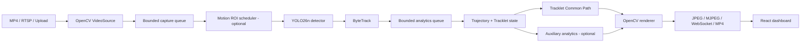
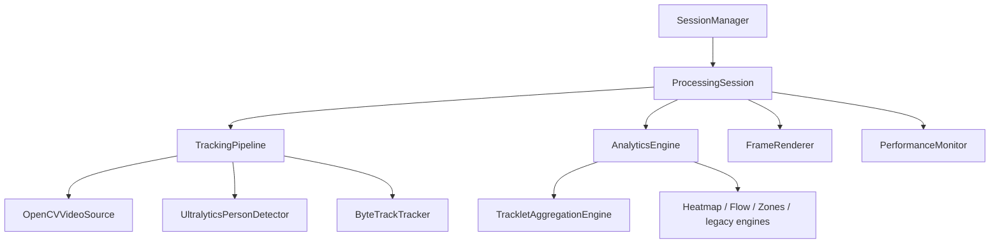

# Tong quan hien trang du an Crowd Analysis

> Cap nhat: 2026-09-28 (Asia/Saigon)
>
> Moc ma nguon duoc doi chieu: `main@f99ec01`
>
> Pham vi: code, cau hinh, pipeline local/web, Modal GPU, benchmark va artifact hien co trong repository.

## 1. Tom tat dieu hanh

Crowd Analysis la he thong phan tich luong di chuyen dam dong tu mot camera. He thong nhan video MP4 hoac RTSP, phat hien nguoi, gan Track ID cuc bo theo phien, chuyen bounding box thanh diem chan nguoi, va tong hop cac quan sat thanh mot hoac nhieu Common Path co huong.

Trang thai hien tai:

- Backend va frontend da hoat dong theo kien truc session don camera, co bounded queue va state tach theo tung phien video.
- Detector hien tai la YOLO26n qua Ultralytics; tracker hien tai la ByteTrack voi association ket hop IoU, khoang cach va lich su chuyen dong ngan.
- Engine Common Path mac dinh la `tracklet_aggregation`, khong dung grid de quyet dinh tuyen.
- Shibuya mac dinh cho phep hien thi toi da 3 Common Path; UI cho phep thay doi Top K tu 1 den 5 ma khong reset tracking hay Common Path state.
- Motion ROI bang MOG2 da duoc tich hop nhu mot scheduler tuy chon, nhung dang tat trong production vi benchmark Shibuya day nguoi chua cho thay loi ich.
- Batch Modal GPU da tach khoi buoc tai artifact: GPU xu ly, ghi ket qua vao Modal Volume, commit Volume va ket thuc; nguoi dung tai ve bang mot lenh rieng.
- Run Shibuya dai gan 10 phut da hoan thanh tren Tesla T4, nhung chi dat 3.88 FPS. He thong chua dat realtime 30 FPS voi profile tiled FP32 hien tai.
- Artifact cua run dai da duoc tai ve, nhung `inspection.md` van la `NOT_REVIEWED`; do chinh xac detection, IDF1, jitter va loi huong van la `REVIEW_PENDING`.
- Lan kiem chung code gan nhat: 147 test Python pass, frontend production build pass, `compileall` va `git diff --check` pass.

## 2. Muc tieu va pham vi san pham

### Chuc nang cot loi

1. Nhan video upload, file local hoac RTSP.
2. Phat hien nguoi theo tung frame.
3. Theo doi nguoi bang Track ID tam thoi trong mot camera/session.
4. Tao diem tracking tai trung diem canh duoi bounding box.
5. Tong hop nhieu doan chuyen dong thanh Common Path co huong.
6. Hien thi video, diem tracking, Common Path, mui ten, trang thai va metric tren dashboard.
7. Ho tro heatmap, vector flow, timeline, zone, calibration va dataset Grand Central khi bat auxiliary analytics.
8. Chay batch/replay/benchmark tren local hoac Modal GPU va xuat artifact co provenance.

### Ngoai pham vi hien tai

- Khong nhan dien khuon mat.
- Khong gan Track ID voi danh tinh that.
- Khong co ReID xuyen camera hoac gallery vector.
- Khong co co so du lieu dai han cho session web.
- Chua chuyen model/backend sang TensorRT.
- Chua co ground truth theo tung nguoi cho video Shibuya, nen chua the cong bo precision, recall, HOTA hay IDF1.
- Chua ho tro nhieu camera dong thoi trong cung mot process production.

## 3. Kien truc tong the



### Ownership state



- `SessionManager` quan ly session dang chay, detector dung lai giua cac session, visualization config va Top K mac dinh.
- `ProcessingSession` so huu tracker, analytics, renderer, metrics va state frame moi nhat cua mot camera.
- `stream_epoch` tach du lieu giua cac lan khoi dong stream; Track ID khong duoc phep tron qua epoch.
- Calibration hoac zone update tao analytics generation moi. Ket qua tu generation cu bi bo qua, tranh viec ket qua cu ghi de state moi.

## 4. Luong xu ly frame

### 4.1 Capture va queue

- `OpenCVVideoSource` doc frame, lay kich thuoc/FPS/frame count va tao `FramePacket` gom frame ID, source timestamp, anh va decode latency.
- Video file realtime duoc pace theo PTS; RTSP dung timestamp suy ra tu frame ID/FPS.
- Capture va inference/tracking chay tren hai worker thread rieng.
- Capture queue mac dinh co kich thuoc 4.
- Realtime dung `drop_oldest` de khong tich backlog; offline dung backpressure de khong mat frame.
- RTSP co reconnect voi exponential backoff tu 1 den 30 giay.

### 4.2 Detection va tracking

Moi frame duoc chon theo `video.inference_interval` di qua detector va tracker. Ket qua duoc gan nhan coverage:

- `MEASURED`: track co detection quan sat that.
- `SEARCHED_NOT_FOUND`: vung cua track da duoc detector tim nhung khong thay.
- `NOT_SEARCHED_BY_POLICY`: scheduler chu dong khong quet vung do.

Ba trang thai nay ngan viec coi frame khong duoc quet nhu mot detection miss that.

### 4.3 Analytics va render

- `FrameResult` duoc dua vao analytics queue rieng, mac dinh toi da 1000 item.
- Analytics worker cap nhat trajectory/Common Path, lay snapshot bat bien, render overlay va ma hoa JPEG.
- Browser cham khong block capture; server chi giu JPEG/frame snapshot moi nhat.
- Metric duoc do rieng cho decode, inference, tracking, analytics, render, encode va end-to-end latency.

## 5. Detector nguoi

### Cong nghe

- Model production: `yolo26n.pt`.
- Runtime: Ultralytics/PyTorch.
- Class mac dinh: `0` (person).
- Device: `auto`; Modal bat buoc CUDA, khong fallback CPU cho cac job GPU da khai bao.

### Che do single-pass

Mot anh day duoc resize theo `imgsz` va dua vao model mot lan. Day la profile nhanh nhat da do, nhung chua du bang chung de thay profile Shibuya tiled vi so Track ID va coverage khac dang ke.

### Che do tiled Shibuya

Profile `configs/shibuya.yaml` chay:

```text
1 full frame + 4 tile (2 x 2, overlap 20%) = 5 detector images/source frame
```

Muc dich la giu nguoi nho/o xa. Hau xu ly:

- Doi toa do detection tu tile ve toa do frame.
- Giu detection manh cham bien tile; chi loai box bien yeu co kha nang la artifact.
- Merge duplicate co nhan biet source: chi gop box cung class, gan tam, scale tuong dong va overlap du lon.
- Khong gop hai detection cung source chi vi chung overlap; dieu nay giam nguy co xoa nham hai nguoi dung gan nhau.
- Ho tro `ignore_regions` theo toa do normalized cho vung man hinh/bien quang cao khong can phan tich.
- Hau xu ly merge duoc vector hoa bang NumPy va co metric rieng `model_predict_ms`, `postprocess_ms`, `merge_ms`.

### Gioi han

Tiled inference tang recall tiem nang nhung la nut that lon nhat. Voi Shibuya, moi source frame tao 5 anh inference, trong khi GPU T4 trung binh chi su dung khoang 31% o run dai. Dieu nay cho thay workload hien tai chua tan dung GPU hieu qua va ton nhieu chi phi CPU/postprocess/tracking.

## 6. Tracker

Tracker mac dinh la ByteTrack, khong dung ReID.

### Association

- Tach detection high/low confidence theo cac nguong ByteTrack.
- Association mode `hybrid` ket hop IoU va khoang cach bottom-center.
- Lich su chuyen dong ngan du doan vi tri tiep theo va cong penalty khi detection di nguoc vector chuyen dong cu.
- Khoang cach duoc scale theo duong cheo frame, chieu cao box, toc do va so frame bi mat.
- Khi source bo frame, Kalman state duoc advance theo frame ID thuc thay vi mac dinh chi mot buoc.

### Occlusion va nguoi dung yen

- Track mat detection co the duoc xuat tam thoi voi `observed=False` trong grace window.
- Nguoi dung yen co grace rieng va velocity damping de bbox khong troi qua nguoi ben canh.
- `coast()` tien Kalman prediction khi Motion ROI chu dong skip inference. No khong goi `update([])`, vi `update([])` se bien mot frame khong duoc tim thanh mot miss that.
- Prediction-only track khong tao support cho Common Path.

### Ban chat Track ID

Track ID la ID tam thoi trong mot session, co the fragment hoac switch khi che khuat/giao cat. `unique_track_ids` trong report khong dong nghia voi so nguoi that duy nhat.

## 7. Motion ROI hybrid

Motion ROI la tinh nang tuy chon nam truoc detector. No chi lap lich detector, khong sinh detection, trajectory, count hoac Common Path evidence.

### Thuat toan

1. Resize frame ve chieu rong phan tich (mac dinh 640).
2. Dung OpenCV MOG2 tao foreground mask.
3. Loc connected component nho va tinh foreground ratio.
4. Chon cac tile detector da duoc kiem chung giao voi motion mask.
5. Them tile bao ve bbox/track prediction dang ton tai.
6. Ap dung periodic full-coverage deadline.
7. Fallback ve reference scan neu mask stale/unhealthy, ROI qua rong, qua nhieu tile, backend khong ho tro ROI, hoac reference re hon.

State machine:

```text
WARMUP -> HYBRID -> FULL_COVERAGE
             |            ^
             v            |
           RECOVER -------+
```

Scan type:

- `reference`: chay profile detector day du.
- `tiles`: chi chay cac tile duoc chon.
- `skip`: khong goi detector, tracker chi coast.

`shadow_mode` tinh quyet dinh hybrid nhung van thuc thi reference scan, dung de audit scheduler ma khong thay doi detector coverage.

### Trang thai production

- `motion_roi.enabled=false` trong `default.yaml` va `shibuya.yaml`.
- Benchmark full 1,951 frame tren Shibuya day nguoi da chon reference o tat ca frame: 5.00 detector images/frame cho ca baseline va hybrid.
- Hybrid khong tiet kiem inference, cham hon 8.2% ve wall time trong lan do do.
- Ket luan hien tai: hop ly ve kien truc va fail-safe, nhung chua co loi ich tren canh Shibuya day; tiep tuc thu tren canh thua nguoi hoac policy tile tot hon truoc khi bat production.

## 8. Common Path hien tai

### Dinh nghia

Common Path la polyline dai gom nhieu doan thang ngan lien tiep, dai dien cho mot tuyen va huong di co nhieu quan sat chuyen dong ung ho. No khong phai trajectory cua mot ca nhan, khong phai spline, va khong chi noi diem dau-cuoi.

Engine production: `TrackletAggregationEngine` trong `backend/app/analytics/tracklet_aggregation.py`.

### 8.1 Dau vao

Moi `TrackletPoint` gom:

- camera ID va stream epoch;
- Track ID va segment ID;
- frame ID va source timestamp;
- bottom-center `(x, y)`;
- `confirmed` va `observed`.

Chi diem `confirmed=true`, `observed=true`, dung thu tu thoi gian va khong den tu tuong lai moi duoc nhan. Prediction khong tao vote.

### 8.2 Tach va loc tracklet

Tracklet bi tach khi:

- segment ID thay doi;
- gap quan sat vuot nguong;
- buoc nhay vuot `max_step_fraction`;
- timestamp/frame quay lui.

Tracklet bi loai neu qua ngan, thoi luong qua nho, displacement thap, zig-zag/stretch qua lon hoac huong noi bo khong nhat quan.

Nguong displacement co perspective scale lien tuc theo toa do Y. Nguoi nho o xa co nguong thap hon ma khong hardcode vung tren/giua/duoi.

### 8.3 Gom cac doan cung tuyen

- Tao nearest-neighbour graph tu centroid va endpoint de gioi han so cap can so sanh.
- Chi noi hai tracklet khi huong tuong thich va co directed overlap, hoac endpoint transition gan va hop ly theo thoi gian/van toc.
- Overlap duoc kiem tra tren local tangent, vi vay hai dong nguoc chieu va cac nhanh giao cat khong bi gop chi vi gan nhau.
- Link score co cache fingerprint gioi han kich thuoc de tranh tinh lai cap tracklet khong thay doi.
- Union-find gom cac tracklet co link hop le thanh candidate cluster.

### 8.4 Dung polyline

- Chon seed co quality tot va do dai gan median, khong uu tien track dai nhat hay nhieu diem nhat.
- `_attach()` so huong tracklet voi tiep tuyen cuc bo tai dau/cuoi route.
- Neu co overlap, cac mau gan nhau duoc median-blend.
- Neu co transition evidence, endpoint duoc noi bang dinh chung trung gian.
- Neu khong co bang chung, doan do khong duoc gan vao route.
- Route chi duoc smooth bang bo loc cuc bo tren polyline quan sat va resample theo arc length; khong dung spline va khong tao duong tat dau-cuoi.
- `segment_length_fraction` dieu khien mat do cac doan thang ngan; so diem bi gioi han de render va matching co chi phi du doan duoc.

### 8.5 Support va ranking

- Mot Track ID tam thoi chi dong gop toi da mot support unit cho candidate.
- Ranking dua tren so Track ID khac nhau, quality tracklet va coverage cua route.
- Do dai bbox, do dai track, FPS hay so sample khong truc tiep lam tang support.
- Candidate cung huong va hinh hoc qua giong nhau bi deduplicate.
- Day la support theo `temporary_track_id`, chua phai so nguoi duy nhat hay so luot di da duoc passage stitching xac minh.

### 8.6 On dinh Path ID, mau va Top K

- Candidate moi duoc gan `path-NNN` va mau on dinh tu bang mau co dinh.
- Hinh hoc/score/confidence/support duoc cap nhat bang EMA.
- Lifecycle: `candidate -> active -> cooling`, sau do phat su kien retire va xoa khoi identity store khi het route-memory TTL.
- Route memory giu identity qua khoang mat evidence ngan.
- Challenger chi thay incumbent khi vuot support margin va giu du thoi gian.
- Top K tu 1 den 5 co the doi tren UI/API; engine chi publish lai selection, khong reset tracker, tracklet buffer hay Path ID.

### 8.7 Renderer

- Ve polyline bang `cv2.polylines`.
- Cac doan lien tiep dung chung dinh.
- Mui ten lap lai theo arc length va local tangent, ke ca o gan diem dich.
- Mau rieng theo Path ID; path `cooling` duoc lam mo/xam.
- Label hien Path ID va support ID.
- Renderer khong duoc dung de che day thieu sot algorithm: duong chi duoc ve khi engine co candidate active/cooling.

### 8.8 Cac engine khac van con trong repository

- `legacy`: grid/route Common Path cu, giu de rollback va compatibility.
- `directional_grid`: histogram huong theo cell, directed edge, validated route hoac dominant direction.
- `shadow`: chay legacy va directional de doi chieu.
- `DominantLiveFlowEngine`: cum chuyen dong ngan han; van con cho cac entrypoint/thu nghiem tuong thich.
- `DD-CRP`: code nghien cuu/offline, mac dinh tat.

Khong engine nao o tren la mac dinh cua `default.yaml` hay `shibuya.yaml` hien tai.

## 9. Auxiliary analytics

`analytics.auxiliary_analytics_enabled=false` trong cac profile production Common Path. Khi bat, he thong co:

- Trajectory co gioi han diem va TTL, EMA smoothing, loc teleport.
- Occupancy heatmap va movement heatmap theo bucket thoi gian.
- Vector flow theo luoi.
- Popular path/zone transition theo co che compatibility.
- Zone occupancy, entry, exit, dwell va flow giua zone.
- Homography 4 diem de chuyen image pixel sang ground plane.
- Timeline so nguoi theo giay.

API compatibility van ton tai khi auxiliary analytics tat, nhung UI an cac panel khong co du lieu de tranh tao cam giac tinh nang dang hoat dong.

## 10. Dashboard va trai nghiem nguoi dung

Frontend hien tai co ba runtime mode:

- `live`: ket noi FastAPI local/server.
- `replay`: doc tracking cache, khong chay detector.
- `modal-live`: nhan frame JPEG va metadata tu Modal WebSocket.

Chuc nang UI:

- Upload/chon video, start/stop session.
- Hien thi frame MJPEG/JPEG/WebSocket.
- Hien diem tracking, Common Path va mui ten.
- Hien FPS, latency, crowd count, RAM/GPU metric neu co.
- Doi so Common Path 1-5.
- Bat/tat overlay visualization ma khong khoi dong lai tracker.
- Calibration ground plane va sua zone.
- Hien heatmap, flow, timeline va zone khi auxiliary analytics duoc bat.
- Panel Common Path liet ke rank, state, support va direction.
- Modal live co authentication token, frame acknowledgement va latest-frame queue kich thuoc 1.

## 11. API chinh

### He thong va metrics

- `GET /health`
- `GET /api/runtime`
- `GET /metrics`
- `GET /api/analytics/metrics`

### Video va stream

- `POST /api/video/upload`
- `POST /api/stream/start`
- `POST /api/stream/stop`
- `GET /api/stream/frame.jpg`
- `GET /api/stream.mjpg`
- `WS /ws/live`

### Cau hinh runtime

- `PUT /api/overlay`
- `GET/PATCH /api/config/visualization`
- `GET/PATCH /api/config/common-path`
- `POST /api/calibration`
- `PUT /api/zones`

### Analytics

- `GET /api/analytics/summary`
- `GET /api/analytics/heatmap`
- `GET /api/analytics/flow`
- `GET /api/analytics/paths`
- `GET /api/analytics/common-paths`
- `GET /api/analytics/flows`
- `GET /api/analytics/zones`

### Grand Central

- Liet ke/metadata/status dataset.
- Prepare dataset.
- Analyze ground truth hoac prediction.
- Lay result va preview JPEG.

OpenAPI UI co tai `/docs` khi backend dang chay.

## 12. Dataset Grand Central

Repository co adapter va workflow rieng cho Grand Central:

- Tai/chuan bi du lieu ngoai Git.
- Doc sparse annotation va chuan hoa timestamp/toa do.
- Tach trajectory khi gap lon.
- Chay point-only ground-truth analytics hoac YOLO + ByteTrack prediction.
- Phan tich pixel space hoac ground plane.
- Xuat preview, JSON/CSV/Parquet va benchmark.

Grand Central co sparse point annotation, khong co bounding box day du cho moi frame. Vi vay co the do count/trajectory proxy, nhung khong the suy ra mAP/HOTA/IDF1 chuan neu thieu nhan can thiet.

## 13. Cong nghe dang su dung

| Lop | Cong nghe | Vai tro |
| --- | --- | --- |
| Ngon ngu backend | Python 3.11-3.14 | Pipeline, API, analytics, benchmark |
| API | FastAPI, Uvicorn, Pydantic v2 | REST, WebSocket, validation, lifecycle |
| Computer vision | OpenCV headless | Decode, MOG2, geometry, render, encode |
| ML runtime | Ultralytics, PyTorch | YOLO26n person detection |
| So hoc | NumPy | Matching, geometry, grid, metric |
| Tracker | Ultralytics ByteTrack duoc boc boi adapter noi bo | MOT khong ReID |
| Du lieu cot | PyArrow | Export/phan tich dataset |
| CPU/RAM monitoring | psutil | Process metrics |
| GPU monitoring | PyTorch CUDA + `nvidia-smi` tren Modal | VRAM/utilization |
| Frontend | React 19, TypeScript, Vite 8 | Dashboard |
| UI charts/icons | Recharts, Lucide React | Timeline/chart va icon |
| Container | Docker Compose, Nginx | Backend/frontend local deployment |
| Cloud GPU | Modal, Tesla T4, Modal Volume | Batch/live GPU va artifact persistence |
| Test | pytest, Playwright scripts, TypeScript build | Unit/integration/UI smoke |

`onnxruntime` va model ONNX co trong dependency/workspace cho benchmark/duong CPU thay the, nhung production Shibuya hien tai van dung Ultralytics/PyTorch `.pt`.

## 14. Cau hinh

### Profile chinh

| File | Muc dich | Detector | Common Path | Motion ROI |
| --- | --- | --- | --- | --- |
| `configs/default.yaml` | Local/general | Single-pass FP32 | Tracklet, Top 1 | Tat |
| `configs/shibuya.yaml` | High-recall Shibuya | Full + 2x2 tile FP32 | Tracklet, Top 3 | Tat |
| `configs/shibuya-fp16.yaml` | A/B performance | Tiled FP16 | Tracklet | Tat |
| `configs/shibuya-single-pass.yaml` | A/B performance | Single-pass FP32 | Tracklet, Top 3 | Tat |
| `configs/shibuya-single-pass-t4.yaml` | Audit cadence T4 | Ke thua single-pass | Update moi 2 giay | Tat |
| `configs/shibuya-motion-roi.yaml` | Thu nghiem hybrid | Tiled co scheduler | Tracklet | Bat |
| `configs/shibuya-motion-roi-shadow.yaml` | Audit scheduler | Reference execution | Tracklet | Shadow |

Config ho tro `extends` va deep merge, co phat hien vong lap. Backend doc duong dan tu bien moi truong `CROWD_CONFIG`; neu khong co thi dung `configs/default.yaml`.

### Nhom tham so quan trong

- Detector: model, `imgsz`, confidence, IoU, max detections, precision, tile layout, overlap, merge IoU, ignore region.
- Tracker: high/low/new thresholds, buffer, match threshold, hybrid association, motion weight, grace frame.
- Pipeline: inference interval, capture queue, analytics queue, drop/backpressure, reconnect.
- Common Path: evidence window, update interval, min support, confirmation, cooling, route memory, segment length, match distance, match angle, overlap, Top K.
- Motion ROI: warmup, mask age, periodic scan, tile budget, track protection, cost guard, recovery hysteresis.
- Visualization: point/path style, arrows, overlay visibility, transition time.

## 15. Modal GPU va artifact workflow

### Batch GPU

`modal_common_path.py`:

1. Hash input video va model.
2. Upload video vao Modal Volume theo content hash neu can.
3. Resolve config, bao gom `extends`, thanh mot payload bat bien.
4. Tao container Debian/Python 3.11 co Tesla T4.
5. Bat buoc CUDA, chay `scripts/common_path_clip.py`.
6. Ghi artifact vao `/root/data/common_path/runs/<run-id>`.
7. Ghi `manifest.json`, resource metrics, `volume.commit()`.
8. GPU function ket thuc; mac dinh khong tai file lon ve may local.

Timeout batch hien tai la 14,400 giay (4 gio), `max_containers=1`, khong retry.

Lenh mau:

```powershell
$runId = "shibuya-$(Get-Date -Format yyyyMMdd-HHmmss)"

modal run --quiet --timestamps modal_common_path.py `
  --input data/videos/data-shibuya-10m.mp4 `
  --engine tracklet_aggregation `
  --mode offline_fast `
  --config configs/shibuya.yaml `
  --run-id $runId `
  --cache-policy reuse
```

Tai artifact rieng:

```powershell
python scripts/download_modal_artifacts.py `
  --run-id $runId `
  --output-dir "outputs/common_path/$runId"
```

Neu thu muc dich da co du lieu tai do, them `--force`.

### Modal live

`modal_shibuya_live.py` cung cap ASGI WebSocket co token:

- Tesla T4, CUDA bat buoc.
- Toi da mot pipeline live cung luc trong container.
- Duration toi da 200 giay, preview 1-15 FPS.
- Processing mode bat buoc `realtime_pts`.
- Queue van chuyen frame co kich thuoc 1; frame cu bi bo neu browser/transport cham.
- Browser gui `frame_ack`; server ghi `live_verification.json` de chung minh UI nhan frame truoc khi job ket thuc.
- Ket qua duoc commit vao cung Modal Volume.

### Replay cache

Tracking cache cho phep chay lai Common Path/render ma khong goi detector. Cache key bao gom source hash, model hash, config/scheduler fingerprint va schema. Co audit flag cho cache cu, nhung van yeu cau source/model hash trung khop.

## 16. Artifact va observability

Mot batch run day du co the tao:

- `tracked_points_common_path.mp4`
- `preview_contact_sheet.jpg`
- `common_path_map.png`
- `tracking_cache.jsonl` va metadata
- `metrics.csv`
- `stage_metrics.csv`
- `long_run_metrics.csv`
- `motion_roi_metrics.csv`
- `scheduler_decisions.jsonl`
- `observation_coverage_by_region.csv`
- `region_funnel.csv`
- `candidate_decisions.jsonl`
- `path_support.jsonl`
- `path_events.jsonl`
- `resource_metrics.jsonl`
- `resource_summary.json`
- `config_resolved.yaml`
- `provenance.json`
- `summary.json`
- `manifest.json`
- `inspection.md`

Metric chinh:

- FPS input va processing.
- p50/p95 decode, model predict, postprocess/merge, inference, tracking, analytics, Common Path compute, render, encode, cache write va E2E.
- Queue size, dropped frame va detector image count.
- CPU, RAM, GPU utilization, VRAM allocated/reserved.
- Tracklet buffer, candidate count, rejection reason, link-cache hit.
- Path ID, state, support, score, revision, event va evidence timestamp.
- Scheduler state, scan type, foreground/ROI ratio va observation coverage theo vung.

## 17. So lieu hien tai

### 17.1 Run Shibuya dai moi nhat

Artifact local:

`outputs/common_path/shibuya-10m-final-20260926-091731/shibuya-10m-final-20260926-091731/`

| Chi so | Ket qua |
| --- | ---: |
| GPU | Tesla T4 |
| Source | 1280 x 720, 30 FPS |
| Thoi luong media thuc | 565.267 giay |
| Frame | 16,959 |
| Remote wall time | 4,372.237 giay (khoang 72.87 phut) |
| Processing FPS | 3.88 |
| Inference p50 / p95 | 146.991 / 169.179 ms |
| Model predict p50 / p95 | 113.788 / 118.921 ms |
| Postprocess/merge p50 / p95 | 30.292 / 49.996 ms |
| Tracking p50 / p95 | 37.823 / 69.950 ms |
| Analytics p50 / p95 | 2.348 / 61.068 ms |
| Common Path compute p50 / p95 | 103.877 / 464.130 ms |
| Render p50 / p95 | 15.579 / 17.798 ms |
| Encode p50 / p95 | 6.428 / 8.900 ms |
| CPU trung binh / dinh | 99.83% / 116.10% |
| GPU utilization trung binh / dinh | 31.025% / 50.0% |
| RAM dinh | 5,512 MB |
| GPU memory dinh theo `nvidia-smi` | 841 MB |

Nhan dinh:

- Run thanh cong va da commit day du artifact.
- Toc do cham hon realtime 30 FPS khoang 7.7 lan.
- Nut that chinh van la detector tiled 5 anh/frame, sau do la tracking/postprocess va cac dot Common Path compute.
- GPU utilization thap trong khi CPU gan mot core day cho thay pipeline chua GPU-bound thuan tuy.
- Final snapshot co 3 path trang thai `cooling`, support lan luot 16, 13 va 10 temporary Track ID.
- `unique_track_ids=2601` la so ID tam thoi, khong phai 2,601 nguoi duy nhat.
- `inspection.md` van `NOT_REVIEWED`; video 719 MB va contact sheet ton tai nhung chua duoc doi chieu chuyen dong that.
- Chua co so lieu `polyline_jitter_px` va `change_detection_delay_s`; khong duoc coi la PASS.

### 17.2 Ket qua A/B da biet

- Tiled FP16 cho smoke 5 giay cai thien inference p50 khoang 19% so voi tiled FP32, nhung chua du de realtime.
- Single-pass FP32 nhanh hon tiled FP32 rat lon trong smoke va full 65 giay, nhung unique temporary ID thay doi dang ke; recall equivalence chua duoc chung minh.
- Motion ROI tren full 1,951-frame Shibuya khong giam so detector image va cham hon baseline, nen van tat.
- Common Path cadence 2 giay giam compute time trong replay, nhung Path ID/support thay doi; profile nay van `REVIEW_PENDING`.

## 18. Kiem thu va bao dam chat luong

Lan kiem chung sau chuoi commit hien tai:

- `python -m pytest -q`: 147 passed.
- `python -m compileall -q backend scripts modal_common_path.py`: passed.
- `npm run build`: TypeScript va Vite production build passed.
- `git diff --check`: passed.

Pham vi test gom config, detector merge, tracker/occlusion/coast, bounded pipeline, trajectory, heatmap, flow, zone, API, Motion ROI state machine, Common Path direction/support/identity, dataset Grand Central va renderer.

Nhung khoang trong con lai:

- Chua co labeled Shibuya MOT ground truth.
- Chua co benchmark HOTA/IDF1/recall tren crossing va occlusion that.
- Chua co 30 phut RTSP soak tren camera that.
- Chua xac nhan Docker GPU runtime tren moi truong hien tai trong dot tong hop nay.
- Chua co visual sign-off cho artifact 10 phut moi nhat.

## 19. Cau truc repository

```text
backend/app/
  analytics/     Common Path, trajectory, heatmap, flow, zones, spatial
  api/           FastAPI routes
  core/          config, session, upload
  datasets/      Grand Central adapter/evaluation/storage
  inference/     detector protocol va Ultralytics implementation
  metrics/       runtime performance monitor
  schemas/       data contracts
  tracking/      ByteTrack adapter
  video/         source, queue, Motion ROI, pipeline, renderer

frontend/src/
  components/    video, metrics, paths, heatmap, flow, timeline, zones
  hooks/         local live, Modal live, spatial polling
  api.ts         REST client
  types.ts       TypeScript contracts

configs/         production va experimental profiles
scripts/         batch, replay, benchmark, diagnostics, dataset tools
docs/            architecture, reports, prompts va tai lieu nay
modal_*.py       Modal batch/live/replay entrypoints
docker/          backend/frontend images va Nginx proxy
outputs/         artifact local, bi ignore boi Git
```

Model, video, dataset raw, output, `.env`, log va artifact lon deu bi `.gitignore`; nguoi clone repository phai tu cung cap chung.

## 20. Cach chay nhanh

### Local development

```powershell
python -m venv .venv
.\.venv\Scripts\Activate.ps1
python -m pip install -e ".[dev]"
$env:CROWD_CONFIG = "configs/shibuya.yaml"
python -m uvicorn backend.main:app --reload --port 8000
```

Terminal frontend:

```powershell
Set-Location frontend
npm ci
npm run dev
```

Mo `http://localhost:5173`; OpenAPI tai `http://localhost:8000/docs`.

### Docker CPU

```powershell
Copy-Item .env.example .env
docker compose up --build
```

Dashboard tai `http://localhost:8080`.

### Docker NVIDIA

```powershell
docker compose -f docker-compose.yml -f docker-compose.gpu.yml up --build
```

Can NVIDIA Container Toolkit va `TORCH_INDEX_URL` phu hop driver/CUDA.

### Test

```powershell
python -m pytest -q
python -m compileall -q backend scripts modal_common_path.py
Set-Location frontend
npm run build
```

## 21. Rui ro va gioi han ky thuat

1. **Chua realtime:** profile tiled Shibuya (duoc thiet ke de tang coverage cho nguoi nho/o xa, nhung chua co accuracy ground truth) dat 3.88 FPS tren T4 cho video 30 FPS.
2. **Detection quality chua co ground truth:** nhieu detection hon khong tu dong nghia recall/precision tot hon.
3. **Track ID fragmentation:** support hien tinh theo temporary ID co the dem mot nguoi nhieu lan sau ID switch.
4. **Perspective:** pixel-space threshold van phu thuoc vi tri camera; scale Y chi la heuristic neu chua calibration.
5. **Common Path visual review:** run dai co output nhung chua duoc sign-off ve huong, giao cat, jitter va tinh lien tuc.
6. **Motion ROI:** dense scene co the danh thuc tat ca tile, khong giam workload.
7. **Single process/session:** chua co scheduler nhieu camera hoac shared batched GPU service.
8. **In-memory state:** restart backend se mat session analytics hien tai.
9. **Modal live gioi han:** mot pipeline live/container, duration toi da 200 giay.
10. **Config/report drift:** mot so tai lieu cu mo ta directional grid/dominant flow la production; source of truth hien tai la YAML va code tai commit duoc ghi o dau tai lieu.

## 22. Uu tien de xuat tiep theo

1. Review video/contact sheet run 10 phut tai cac moc tren/giua/duoi va cap nhat `inspection.md`.
2. Gan nhan mot tap Shibuya nho cho person detection va MOT de do recall, precision, IDF1/HOTA, crossing va occlusion.
3. Profiling sau hon tai ranh gioi CPU-GPU: batch shape, host-to-device, Ultralytics preprocess/postprocess va tile merge.
4. Thu policy tile theo tan suat, reduced tile cadence hoac dynamic batching; khong bat Motion ROI production truoc khi co A/B quality.
5. Replay cung mot cache de do jitter, loi dao huong, path switch va change delay cho Common Path.
6. Toi uu Common Path compute p95 ma khong thay doi Path ID/support semantics.
7. Chi danh gia TensorRT sau khi co baseline accuracy va pipeline metrics on dinh; tranh tron loi ich backend voi loi ich thuat toan.
8. Neu mo rong nhieu camera, tach shared GPU inference service va giu tracker/analytics state theo camera.

## 23. Tai lieu va source of truth

- `README.md`: khoi dong nhanh.
- `docs/architecture.md`: kien truc nen tang, co mot so mo ta Common Path cu can doc kem tai lieu nay.
- `docs/bottleneck_report.md`: audit nut that T4 truoc run dai moi nhat.
- `docs/shibuya_performance_report.md`: A/B tiled, FP16, single-pass, detector/tracker va Motion ROI.
- `docs/tracklet_common_paths_realtime_report.md`: refactor sang tracklet engine.
- `configs/default.yaml`, `configs/shibuya.yaml`: source of truth cho profile runtime.
- `backend/app/analytics/tracklet_aggregation.py`: source of truth cho Common Path production.
- `backend/app/video/pipeline.py`: source of truth cho capture/detection/tracking flow.
- `backend/app/core/session.py`: source of truth cho session, analytics/render worker va config generation.
- `modal_common_path.py`: source of truth cho batch GPU + Volume workflow.
- Artifact run: `outputs/common_path/shibuya-10m-final-20260926-091731/`.

Khi co mau thuan giua report cu va code, uu tien theo thu tu: config resolved cua run -> manifest/provenance cua artifact -> code tai commit -> tai lieu tong hop -> report cu.
